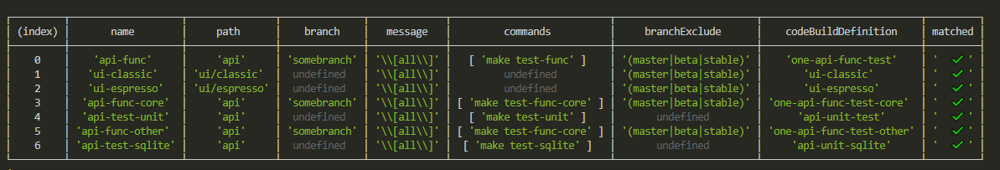
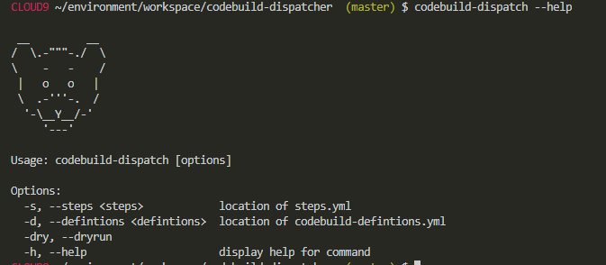

# Codebuild Dispatcher

Have you ever wonder why there are no tools to trigger a build only when certain directories changes that works across multiple languages? Well here is a tool for it.



This tool is closely itegrated with AWS Codebuild, but we accept pull requests to improve it.

## Installation
`npm install -g codebuild-dispatcher` to install this tool globally, after you've done that, you can call the cli with `codebuild-dispatch`

## Configuration
In order to use this tool, you need to have two files in the directory where you're calling the cli, the functions of the two files are:

### steps.yml
steps.yml describes the critieria and the action to take when the criteria matches. 

For an example of this file, please see [here](src/tests/fixture/steps.yml);

It is a yaml array, and each element of the array has the following keys:
| name of key | description | example | mandatory |
|-------------|-------------|---------|-----------|
| name | name of the step | api-unit-test | ✓ |
| codeBuildDefinition | name of the Codebuild Definition defined in `codebuild-definitons.yml` |  | ✓ |
| commands | array of commands to pass into the CodeBuild run | | X |
| path | regex for path matching rule | `/api` or `api` | One of `path`, `branch`, `message` or `branchExclude` has to exsit |
| branch | regex for branch matching rule | `master` | One of `path`, `branch`, `message` or `branchExclude` has to exsit |
| message | regex to match to commit message | `\[all\]` | One of `path`, `branch`, `message` or `branchExclude` has to exsit |
| branchExclude | regex to match for the branch to exclude | `beta` `stable` | One of `path`, `branch`, `message` or `branchExclude` has to exsit |

#### How does matching work
There are four parameters that can affect the outcome of matching, they are `path`, `branch`, `message` and `branchExclude`. 

When a certain git commit is being evaluated, the `branchExclude` is being evaluated first, if this regex evaluates to true with the current branch name, the current step is skipped. After `branchExclude` is evaluated to false, as long as any of the `path`, `branch` and `message` ecvaluates to true, the step will be executed.

#### Commands
Commands are concatnated and set as the `CI_COMMANDS` environment variable in the CodeBuild job, in your `buildspec.yml`, you can then use `eval "$CI_COMMANDS"` to evaluate and run the CI commands defined in `steps.yml`.

### codebuild-definitions.yml
`codebuild-definitions.yml` is used to defind the codebuild job to run. As previously mentioned, a codebuild job is matched to a step using the name parameter.

For an example of this file, please see [here](src/tests/fixture/codebuild-definitions.yml);

Here is an example of an element in the `codebuild-definitions.yml`:

```
- name: ui-classic
  projectName: one-ui-classic-test # every 
  buildspecOverride: buildspec-ui-classic.yml
```

The above defines a codebuild definiton with name `ui-classic` so you can refer to this in `steps.yml` as `ui-classic` in the `codeBuildDefinition` field. It also defines the CodeBuild project name to trigger the build, as well as the buildspec to use. In fact, every field in the AWS Javascript SDK's `startBuild` method can be applied in this yml file. For reference, please see [here](https://docs.aws.amazon.com/AWSJavaScriptSDK/latest/AWS/CodeBuild.html#startBuild-property).

## Running
Once you have finished the installation, you can run `codebuid-dispatch` in your application's root directory and you running environment has to have sufficient AWS IAM previlige to start CodeBuild runs. 


### Commandline options


### IAM Policy
Permission to perform `codebuild:startBuild` action has to be granted to the corresponding resources and roles.


